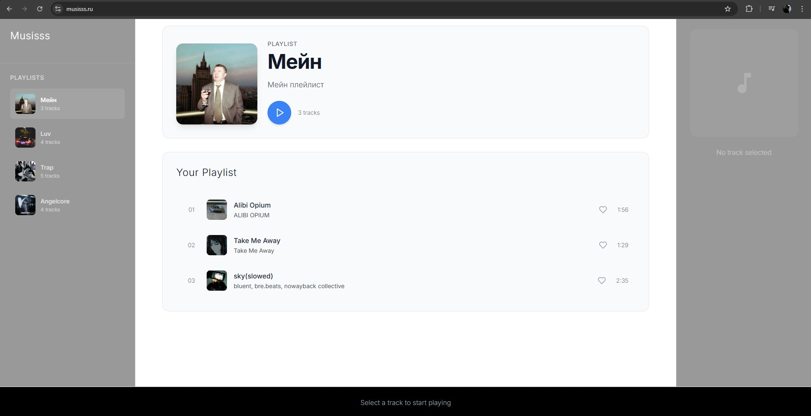
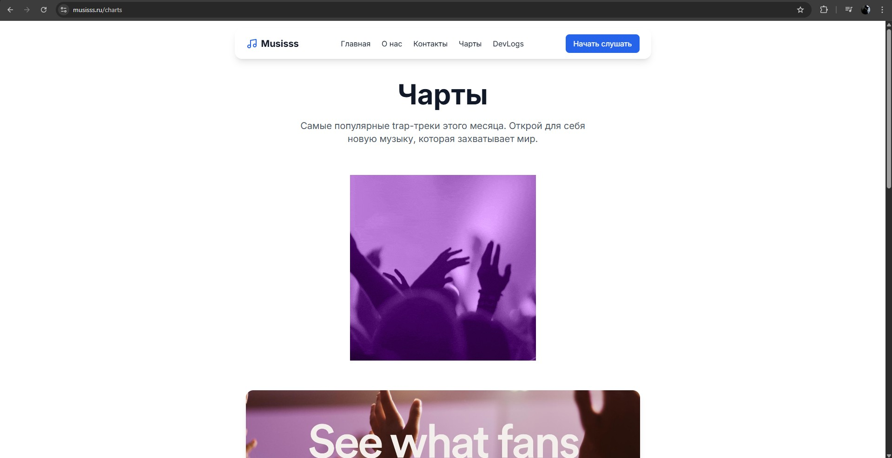
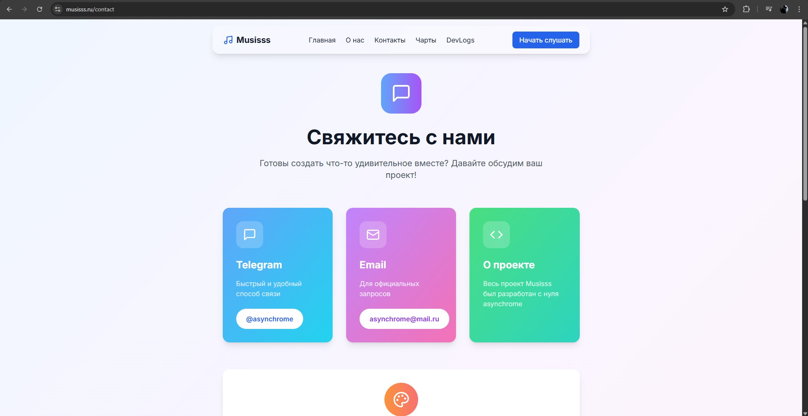
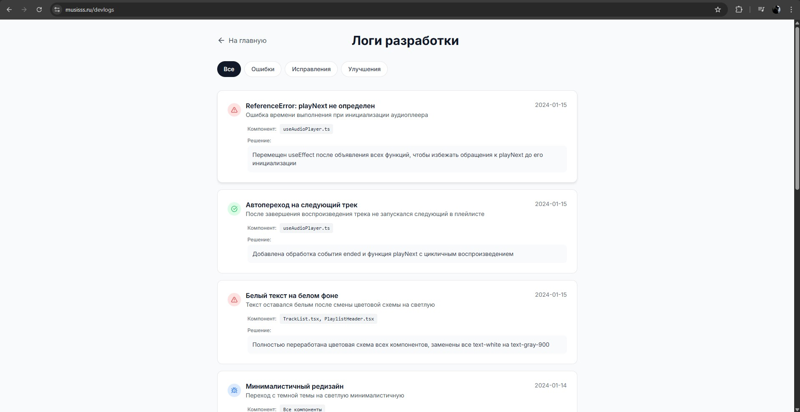
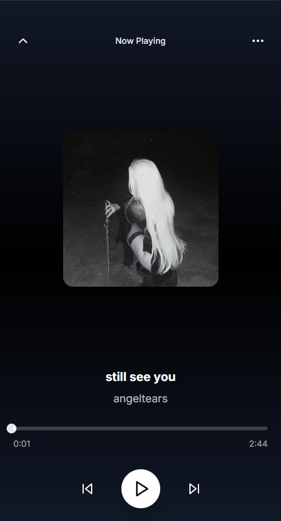

# 🎵 Musisss

Современный музыкальный плеер с минималистичным дизайном и бесконечным потоком качественного звука. Простота, элегантность и чистое удовольствие от прослушивания музыки.










## ✨ Особенности

- 🎧 **Высокое качество звука** - Кристально чистое воспроизведение
- 🎨 **Минималистичный дизайн** - Ничего лишнего, только музыка
- ⚡ **Быстрая работа** - Оптимизированная производительность 
- 📱 **Адаптивный интерфейс** - Идеально на любом устройстве
- 💫 **Умные рекомендации** - AI подбор музыки по вкусу
- 🔄 **Синхронизация** - Продолжайте слушать с любого устройства

## 🚀 Технологии

- **Frontend**: Next.js 15.5.2, React 18, TypeScript
- **Стили**: Tailwind CSS, Lucide Icons
- **Аудио**: HTML5 Audio API
- **Состояние**: React Hooks
- **Сборка**: Webpack, SWC

## 📦 Установка

```bash
# Клонирование репозитория
git clone https://github.com/asynchrome/musisss.git
cd musisss

# Установка зависимостей
npm install

# Запуск в development режиме
npm run dev

# Production сборка
npm run build
npm start
```

## 🎮 Использование
**Выберите плейлист из доступной коллекции**

**Начните воспроизведение нажатием на трек**

**Управляйте плеером через интуитивные контролы**

**Добавляйте в избранное понравившиеся треки**


## 📁 Структура проекта
src/
├── app/                 # Next.js App Router
│   ├── about/          # Страница "О нас"
│   ├── charts/         # Чарты и рейтинги
│   ├── contact/        # Контакты
│   └── player/         # Основной плеер
├── components/         # React компоненты
│   ├── GlassHeader.tsx # Стеклянный хедер
│   ├── PlayerControls.tsx # Контролы плеера
│   └── TrackList.tsx   # Список треков
├── hooks/              # Кастомные хуки
│   ├── useAudioPlayer.ts # Аудио плеер
│   └── useFavorites.ts # Управление избранным
└── types/              # TypeScript типы

## 🎨 Дизайн
Musisss использует минималистичный дизайн с акцентом на контент:

- **Чистая типографика**

- **Плавные анимации**

- **Стеклянные эффекты**

- **Адаптивная сетка**

- **Интуитивная навигация**

## 👨‍💻 Разработчик
**asynchrome** - Full-stack разработчик и дизайнер - telegram(@asynchrome)

"Musisss создан с любовью к музыке и технологиям. Каждая деталь продумана для максимального удовольствия от прослушивания."

## 🌐 Деплой
Проект готов к деплою на различные платформы:
```bash
# Vercel (рекомендуется)
npm i -g vercel
vercel deploy

# Netlify
npm run build
# Загрузить папку .next в Netlify

# Собственный сервер
npm run build
npm start
```

## 📊 Производительность
⚡ 95+ баллов Lighthouse

🖼️ Оптимизированные изображения

🔊 Эффективное управление аудио

📦 Tree shaking и code splitting

## 🤝 Contributing
Приветствуются contributions! Чтобы внести свой вклад:

Форкните репозиторий

Создайте feature branch (git checkout -b feature/amazing-feature)

Закоммитьте изменения (git commit -m 'Add amazing feature')

Запушьте branch (git push origin feature/amazing-feature)

Откройте Pull Request

## 📝 Лицензия
Этот проект распространяется под MIT License - смотрите файл LICENSE для деталей.

🎵 Музыкальные возможности
▶️ Воспроизведение треков

⏭️ Следующий/предыдущий трек

🔄 Повтор плейлиста

⏯️ Пауза/продолжение

🔍 Поиск по трекам и плейлистам

💖 Добавление в избранное

⏱️ Прогресс бар с перемоткой

🔊 Контроль громкости

## 📞 Поддержка
Если у вас есть вопросы или предложения:

✈️ Telegram: @asynchrome

🐛 Issues: GitHub Issues

Musisss · Сделано с ♡ для ценителей музыки · © 2025 asynchrome
